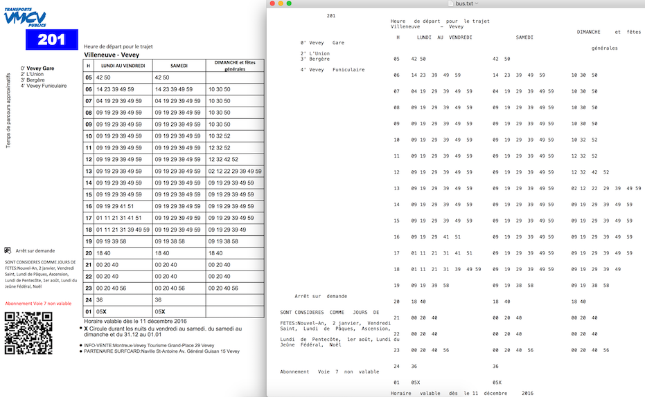
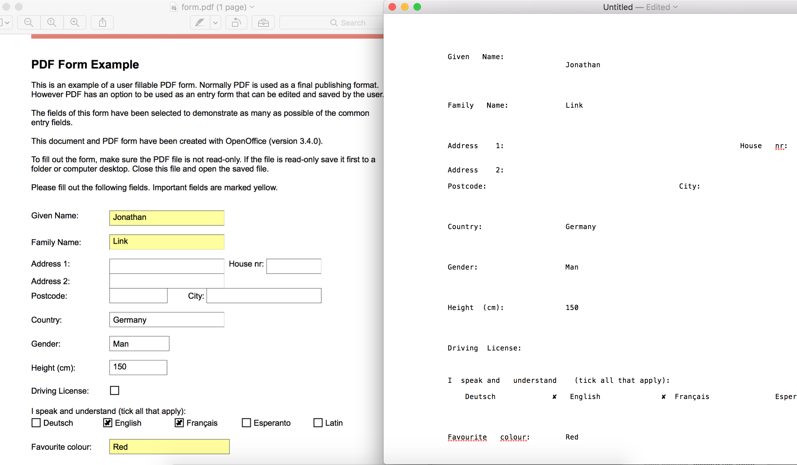

# PDFLayoutTextStripper

Converts a PDF file into a text file while keeping the layout of the original PDF. Useful to extract the content from a table or a form in a PDF file. PDFLayoutTextStripper is a subclass of PDFTextStripper class (from the [Apache PDFBox](https://pdfbox.apache.org/) library).

## Use cases
Data extraction from a table in a PDF file

-
Data extraction from a form in a PDF file


## How to install

### Maven
```
<dependency>
  <groupId>io.github.jonathanlink</groupId>
  <artifactId>PDFLayoutTextStripper</artifactId>
  <version>2.2.3</version>
</dependency>
```

### Manual
1) Install **apache pdfbox** manually ([to get the v2.0.6 click here](https://mvnrepository.com/artifact/org.apache.pdfbox/pdfbox/2.0.6) ) and its two dependencies
commons-logging.jar and fontbox

>**warning**: only pdfbox versions **from version 2.0.0 upwards** are compatible with this version of PDFLayoutTextStripper.java


### How to use on Linux/Mac
```
cd PDFLayoutTextStripper
javac -cp .:/pathto/pdfbox-2.0.6.jar:/pathto/commons-logging-1.2.jar:/pathto/PDFLayoutTextStripper/fontbox-2.0.6.jar *.java
java -cp .:/pathto/pdfbox-2.0.6.jar:/pathto/commons-logging-1.2.jar:/pathto/PDFLayoutTextStripper/fontbox-2.0.6.jar test
```

### How to use on Windows

The same as for Linux (see above) but replace :  with ;

## Sample code
```
import java.io.File;
import java.io.FileNotFoundException;
import java.io.IOException;
import org.apache.pdfbox.io.RandomAccessFile;
import org.apache.pdfbox.pdfparser.PDFParser;
import org.apache.pdfbox.pdmodel.PDDocument;
import org.apache.pdfbox.text.PDFTextStripper;

public class test {
	public static void main(String[] args) {
		String string = null;
        try {
            PDFParser pdfParser = new PDFParser(new RandomAccessFile(new File("./samples/bus.pdf"), "r"));
            pdfParser.parse();
            PDDocument pdDocument = new PDDocument(pdfParser.getDocument());
            PDFTextStripper pdfTextStripper = new PDFLayoutTextStripper();
            string = pdfTextStripper.getText(pdDocument);
        } catch (FileNotFoundException e) {
            e.printStackTrace();
        } catch (IOException e) {
            e.printStackTrace();
        };
        System.out.println(string);
	}
}
```

## Contributors
Thanks to

* Dmytro Zelinskyy for reporting an issue with its correction (v2.2.3) 
* Ho Ting Cheng for reporting an issue (v2.1)
* James Sullivan for having updated the code to make it work with the latest version of PDFBox (v2.0)
