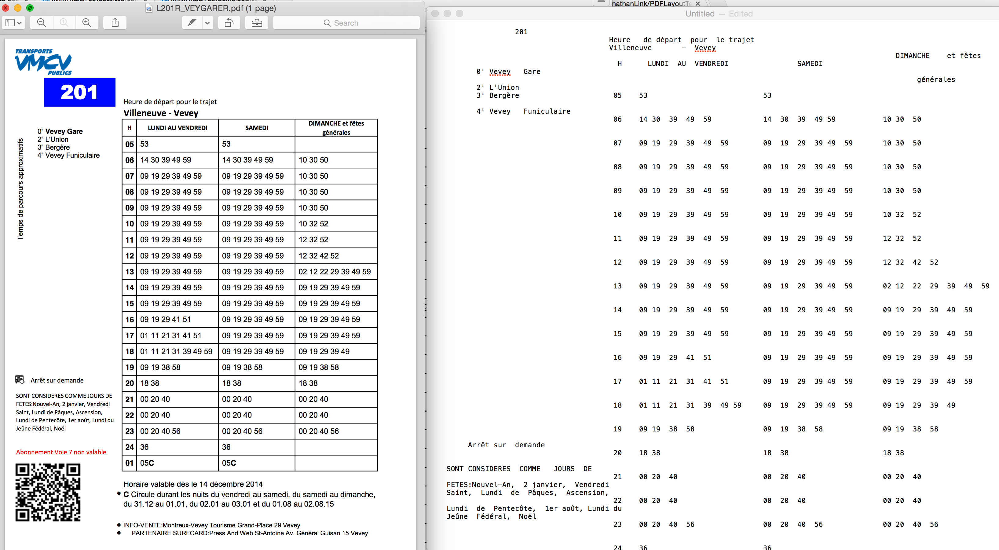

#PDFLayoutTextStripper

Convert a PDF file to a text file while keeping the layout. Useful to extract the content from a table in a PDF file for instance. This is a subclass of PDFTextStripper class (from Apache PDFBox library).

